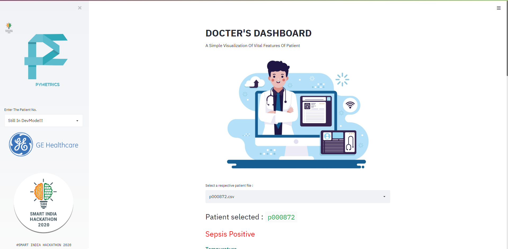
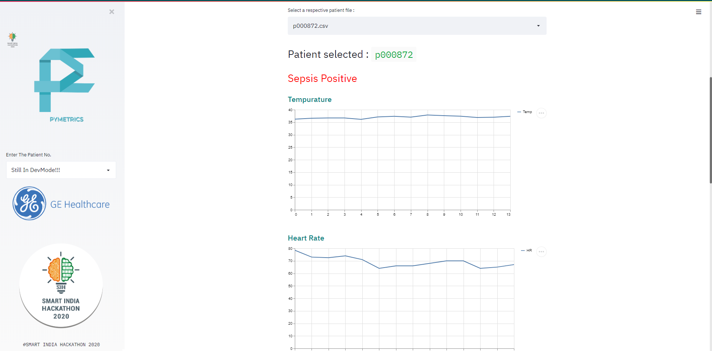
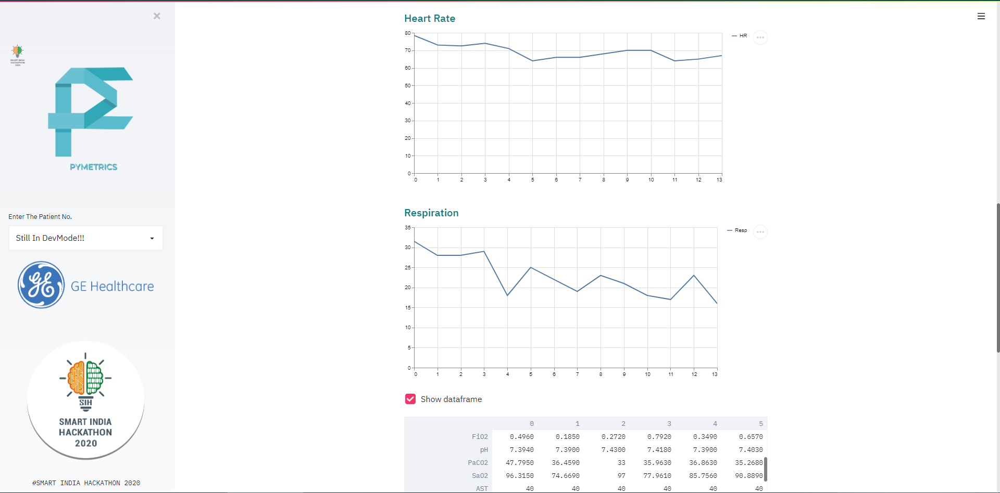
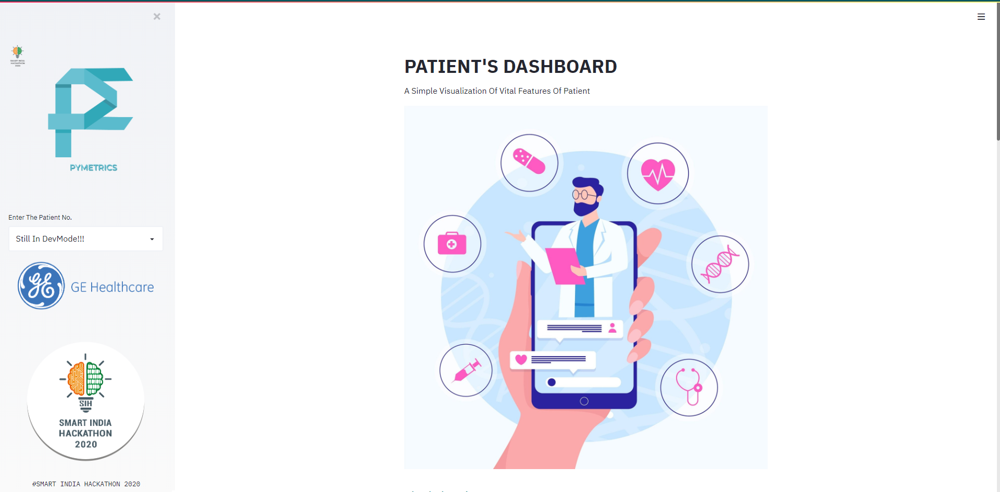
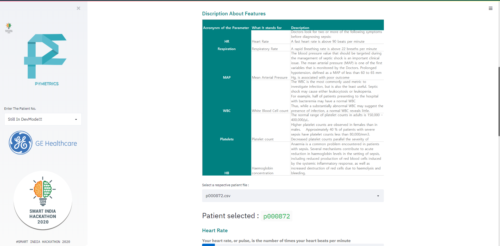
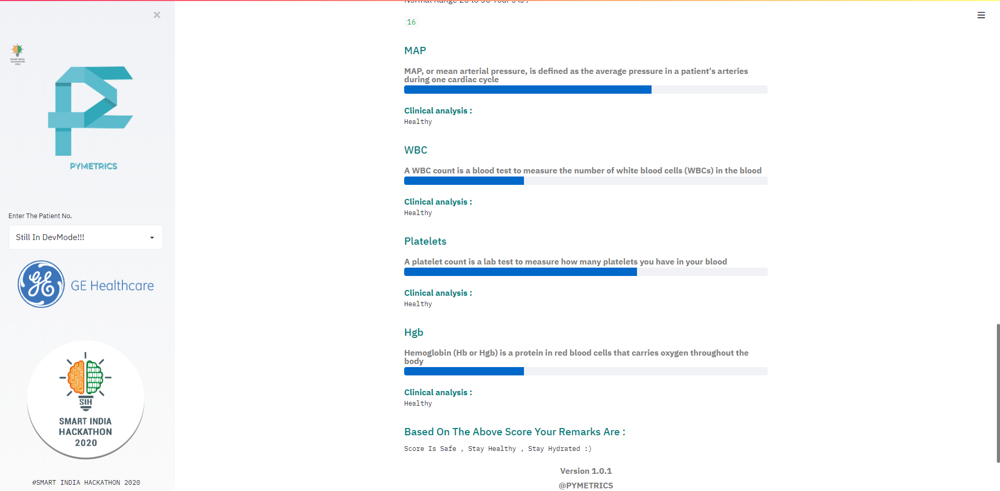

Pymetrics uses Streamlit app framework​ that enable Streamlit web apps to use its 
Rapidly build the tools you need. This semantic search engine and model comparison 
tool was built from scratch with only 23 Streamlit function calls. . You can follow 
an example that shows how to use this Streamlit framework.

Streamlit’s open-source app framework is the easiest way for data scientists and 
machine learning engineers to create beautiful, performant apps in only a few hours!  
All in pure Python. All for free.

Note ​ : PyMetrics is still under development, and some APIs and platforms might
not be available yet. ​Feedback​ and ​Pull Requests​ are most welcome!

To check out the code, please clone the repository into your workspace and
import the project using flutter or android studio. *​Make use you use your local
gradle to build the source code.*

The Web App consists of 2 components:

1.  Docter's Dashboard

2.  Patient's Dashboard


**Snapshots Of The Application :**

**Docter's Dashboard:**







**Patients Dashboard:**








**How To Run**
Clone the repository. Change the Folder path to your system paths.Install Streamlit and you are ready to go.

Preview
=======

Getting Started
---------------

## Installation

```bash
pip install streamlit
streamlit hello
```

We also have suggestions for installing Streamlit in a virtual environment 
in [Windows](https://github.com/streamlit/streamlit/wiki/Installing-in-a-virtual-environment#on-windows), 
[Mac](https://github.com/streamlit/streamlit/wiki/Installing-in-a-virtual-environment#on-mac--linux), 
and [Linux](https://github.com/streamlit/streamlit/wiki/Installing-in-a-virtual-environment#on-mac--linux).

This project is a starting point for a Streamlit web application.

## More Information

- Our [launch post](https://towardsdatascience.com/coding-ml-tools-like-you-code-ml-models-ddba3357eace)
- Our lovely [community](https://discuss.streamlit.io/)
- Streamlit [documentation](https://docs.streamlit.io/)
- More [demo projects](https://github.com/streamlit/)
- If you would like to contribute, see [instructions here](https://github.com/streamlit/streamlit/wiki/Contributing)

## Streamlit for Teams

[Streamlit for Teams](https://streamlit.io/for-teams/) is our enterprise edition, with single-click deploy, authentication, web editing, versioning, and more. Please contact us if you would like to learn more.

## License

Streamlit is completely free and open source and licensed under the [Apache 2.0](https://www.apache.org/licenses/LICENSE-2.0) license.
